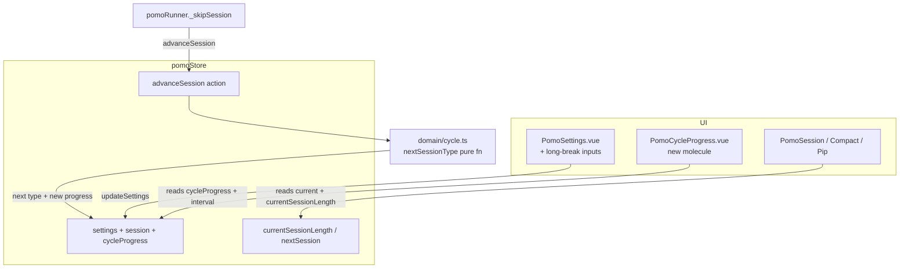

# Long-Break Cycle Design

**Spec**: `.specs/features/long-break-cycle/spec.md`
**Context**: `.specs/features/long-break-cycle/context.md`
**Status**: Draft

---

## Architecture Overview

The feature extends the existing WORK ↔ BREAK toggle into a three-state cycle by adding a `LONG_BREAK` session type, two new settings, and a persisted `cycleProgress` counter. The session-transition decision — today a one-liner ternary in `pomoRunner._skipSession` — is lifted into a **pure domain function** (`nextSessionType`) so it is unit-testable in isolation (the spec requires new domain logic to be covered by tests, and current coverage is `date-utils`-only).

Everything routes through the single existing transition point: `startNextSession` → `_skipSession`. Both natural session end (user advances) and manual skip pass through it, so "skip counts toward the cycle" falls out for free.



---

## Code Reuse Analysis

### Existing Components to Leverage

| Component | Location | How to Use |
| --------- | -------- | ---------- |
| `PomoSessionInput` | `primary/components/molecules/PomoSessionInput.vue` | Reuse as-is for the two new settings inputs (already supports `min`, `hint`, `label`, stepper). |
| `PomoSettings.vue` | `primary/components/organisms/` | Add two more `PomoSessionInput`s + two `v-model` props. Same pattern as work/break. |
| `updateSettings` action + `settings` reactive in HomePage | `pomoStore.ts`, `HomePage.vue` | Extend the `settings` reactive and the two `v-model` bindings; no new flow. |
| `_skipSession` transition point | `pomoRunner.ts:73` | Replace the ternary with a call to the new store `advanceSession` action. |
| `_onSessionEnd` alarm | `pomoRunner.ts:120` | **No change** — already plays the alarm for any session type (satisfies LBC-05). |
| Enum-value labels | `PomoSession.vue:16`, `Compact:18`, `Pip` | Render `session.current.toString()`. Setting `LONG_BREAK = 'Long break'` makes "Long break session" appear with **zero view edits**. |
| `persist: true` | `pomoStore.ts:58` | Persists the whole store, so `cycleProgress` and new settings persist automatically (LBC-15). |

### Integration Points

| System | Integration Method |
| ------ | ------------------ |
| Web Worker countdown | Untouched — `currentSessionLength` getter just returns the right minutes for `LONG_BREAK`; the worker is type-agnostic. |
| PIP window | Shares the same store via re-`provide`; reads the same getters, so it reflects long breaks automatically. |
| pinia-plugin-persistedstate | Hydrates via patch/merge, so existing users missing the new keys fall back to the `config` defaults (see migration note). |

---

## Components

### `nextSessionType` (pure domain function)

- **Purpose**: Decide the next session type and the new cycle progress from the current type, current progress, and the interval — the entire cycle rule, with no Vue/store dependency.
- **Location**: `src/domain/cycle.ts` (new; domain layer is pure logic, no Vue deps).
- **Interface**:
  - `nextSessionType(current: PomoSessionType, cycleProgress: number, longBreakInterval: number): { next: PomoSessionType; cycleProgress: number }`
- **Logic**:
  - `WORK` → `progress = cycleProgress + 1`; `next = progress >= max(1, interval) ? LONG_BREAK : BREAK`; return `{ next, cycleProgress: progress }`.
  - `LONG_BREAK` → `{ next: WORK, cycleProgress: 0 }` (reset).
  - `BREAK` → `{ next: WORK, cycleProgress }` (unchanged).
  - `>= interval` (not `===`) handles a mid-cycle interval decrease (LBC-14); `max(1, interval)` guards against an interval < 1 (LBC-09 safety net).
- **Dependencies**: `PomoSessionType` only.
- **Reuses**: nothing — pure.
- **Tested by**: `tests/cycle/cycle.test.ts` (covers WORK→BREAK, Nth WORK→LONG_BREAK, LONG_BREAK→WORK reset, BREAK→WORK, skip parity, interval-lowered-mid-cycle, interval<1 guard).

### `advanceSession` (store action)

- **Purpose**: Apply `nextSessionType` to store state — the only mutator of `cycleProgress` and `session.current` during a transition.
- **Location**: `pomoStore.ts` actions.
- **Interface**: `advanceSession(): void`
- **Logic**: calls `nextSessionType(this.session.current, this.cycleProgress, this.settings.longBreakInterval)`, assigns `this.session.current = next` and `this.cycleProgress = cycleProgress`.
- **Dependencies**: `nextSessionType`.

### `currentSessionLength` getter (extended)

- **Purpose**: Three-way length lookup.
- **Location**: `pomoStore.ts` getters (replace existing binary ternary).
- **Logic**: `WORK → workSessionLength`, `LONG_BREAK → longBreakSessionLength`, default (`BREAK`) → `breakSessionLength`.

### `nextSession` getter (repurposed)

- **Purpose**: Non-mutating preview of the next type (currently defined but **unused** anywhere — confirmed by grep). Repoint it at `nextSessionType(...).next` so any future "next up" UI is consistent with the real transition.
- **Location**: `pomoStore.ts` getters.

### `PomoCycleProgress.vue` (new molecule — P2)

- **Purpose**: Show progress through the current cycle (LBC-10..12).
- **Location**: `primary/components/molecules/PomoCycleProgress.vue`.
- **Interface (props)**: `progress: number`, `total: number` — render `total` dots with `progress` filled (and/or `{{ progress }} / {{ total }}`).
- **Dependencies**: presentational only; parent passes `pomoStore.cycleProgress` and `pomoStore.settings.longBreakInterval`.
- **Placement**: rendered in `PomoSession.vue` (full view) for MVP; `PomoSessionCompact`/`Pip` are optional follow-on (note in tasks, not required by P2).

### `PomoSettings.vue` (extended)

- **Purpose**: Expose the two new settings (LBC-06).
- **Changes**: add two `PomoSessionInput`s — "Long break" (`hint="min"`, `:min="0"`) and "Long break after" (`hint="pomos"`, `:min="1"`) — plus `longBreakSessionLength` / `longBreakInterval` props and `update:` emits, mirroring the existing work/break pair. `HomePage.vue` extends its `settings` reactive (seeded from new getters) and adds the two `v-model:` bindings.

### `_updateMetaTitle` (extended)

- **Location**: `pomoRunner.ts:104`.
- **Change**: replace the binary `WORK ? 'Work session' : 'Break session'` with a label map so `LONG_BREAK` renders "Long break session" in the tab title.

---

## Data Models

```typescript
// src/domain/Pomodore.ts
export enum PomoSessionType {
    WORK = 'Work',
    BREAK = 'Break',
    LONG_BREAK = 'Long break' // value doubles as the display label
}

export interface PomoSettings {
    workSessionLength: number;
    breakSessionLength: number;
    longBreakSessionLength: number; // NEW — minutes
    longBreakInterval: number;      // NEW — work sessions before a long break
}
```

```typescript
// src/primary/infrastructure/store/pomoStore.ts — PomoState
interface PomoState {
    id: number;
    settings: PomoSettings;
    session: PomoSessionState;
    cycleProgress: number; // NEW — completed work sessions in the current cycle (0..interval)
    currentView: 'session' | 'settings';
}

const config: PomoSettings = {
    workSessionLength: 40,
    breakSessionLength: 5,
    longBreakSessionLength: 15, // NEW default (> break)
    longBreakInterval: 4        // NEW default (classic)
};
// state: cycleProgress: 0
```

**Relationships**: `cycleProgress` is store-level (cross-session) state, deliberately *not* on `PomoSessionState` (which is per-session). It pairs with `settings.longBreakInterval` for the progress UI and the transition decision.

---

## Error Handling Strategy

| Error Scenario | Handling | User Impact |
| -------------- | -------- | ----------- |
| Interval typed/stepped below 1 | `PomoSessionInput :min="1"` clamps the stepper; `nextSessionType` uses `max(1, interval)` as a runtime guard | Interval can never be 0/negative; long break still fires sanely |
| Long-break length empty/below 0 | Same `:min="0"` behavior as the existing break input (consistent) | Matches current work/break validation |
| Existing user has persisted state without the new keys | persistedstate patch-merge leaves `config` defaults in place for missing keys | New settings appear pre-filled with defaults; no crash |
| Interval lowered mid-cycle below current progress | `nextSessionType` uses `progress >= interval` | Next break is correctly a long break |

---

## Tech Decisions

| Decision | Choice | Rationale |
| -------- | ------ | --------- |
| Where the cycle rule lives | Pure `nextSessionType` in `domain/` | Unit-testable without Vue/Pinia; honors the "domain = pure, no Vue" principle and the spec's test requirement |
| Cycle progress location | Store-level `cycleProgress`, not on `PomoSessionState` | It's cross-session cycle state, not per-session; keeps `PomoSessionState` clean |
| Long-break display label | Enum value `'Long break'` | Existing views render `current.toString()`, so labels work with no view changes |
| Advance happens in `_skipSession` | Single transition point | Both natural end and skip flow through it → skip-counts-toward-cycle is automatic |
| `onButtonClick` ("Start" / "Apply and restart") | Reset `cycleProgress = 0` | It forces `current = WORK` to begin a fresh run, so a fresh cycle should start too. (Distinct from `restartSesion`/`clearSession`, which preserve progress per LBC-15.) |
| Progress indicator scope | Full `PomoSession` view for MVP | Compact/PIP are optional follow-ons; keeps P2 small |

---

## Requirement Coverage

| Req | Addressed by |
| --- | ------------ |
| LBC-01,02,03 | `nextSessionType` + `advanceSession` |
| LBC-04 | `currentSessionLength` getter (LONG_BREAK branch) |
| LBC-05 | existing `_onSessionEnd` (no change) |
| LBC-06,07 | `PomoSettings.vue` + `config` defaults + `HomePage` wiring |
| LBC-08 | `updateSettings` + `persist: true` |
| LBC-09 | `:min="1"` input + `max(1, interval)` guard |
| LBC-10,11,12 | `PomoCycleProgress.vue` reading `cycleProgress` / `longBreakInterval` |
| LBC-13 | transition centralized in `_skipSession` |
| LBC-14 | `progress >= interval` |
| LBC-15 | store-level `cycleProgress` + `persist: true`; `restartSesion`/`clearSession` leave it untouched |
